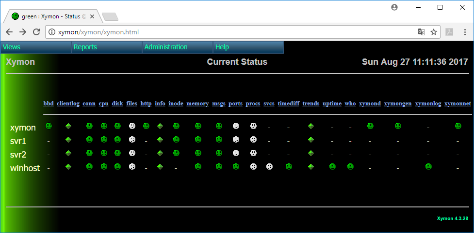

## Vagrant project to test Xymon install - Server (Linux only) and client (Linux and Windows)
This Vagrantfile will setup 3 servers.
- xymon - Acts as Xymon server and Ansible control machine (ssh on localhost:2222)
- svr1 - Acts as Linux client - will have the Xymon client installed (ssh on localhost:2223)
- svr2 - Acts as Linux client - will have the Xymon client installed (ssh on localhost:2224)

Your Windows host machine will act as the forth machine and have a Xymon client installed as well (PowerShell based).

### Preparations
Add the following to your hosts file (`C:\Windows\system32\drivers\etc\hosts`)

```
10.10.10.10 xymon
```
This will enable you to access Xymon with your browser on http://xymon/ once the setup is done.

### Install Vagrant
If you are unfamiliar with a Vagrant setup you can find a quick guide here: [Vagrant quick setup](SETUP-VAGRANT.md)

### Install Xymon server
Login to the `xymon` (eg. `ssh vagrant@xymon -p 2222`  or `vagrant ssh`) box (is also Ansible control machine) as vagrant/vagrant.

```bash
cd /vagrant
ansible-playbook -i ansible-hosts ~/xymon-plays/ansible/xymon-server.yml
```

The command below will setup Xymon server for this test scenario.    
It is a prerequisite for this playbook to run that WinRM is configured and running on your Windows machine.  
[Click this link to see how to setup WinRM](SETUP-WINRM.md)

```bash
cd /vagrant
ansible-playbook -i ansible-hosts scripts/copy-xymon-hosts-template.yml -u henrik -k
```
Change the username (`-u` parameter) in the above to a user that has administrative permissions on
the Windows host (is a member of Local Administrators). If you are using an AD account the username
should be suffixed with the domain name eg. `user@company.com`.

### Install Xymon Linux Clients
Login to the `xymon` box as vagrant/vagrant.

```bash
cd /vagrant
ansible-playbook -i ansible-hosts ~/xymon-plays/ansible/xymon-client-linux.yml
```

### Install Xymon Windows Clients
Login to the `xymon` box as vagrant/vagrant.
The command below will install a Xymon client (PowerShell based) on your host machine.  
It is a prerequisite for this playbook to run that WinRM is configured and running.  
[Click this link to see how to setup WinRM](SETUP-WINRM.md)

```bash
cd /vagrant
ansible-playbook -i ansible-hosts ~/xymon-plays/ansible/xymon-client-windows.yml -u henrik -k
```
Change the username (`-u` parameter) in the above to a user that has administrative permissions on
the host (is a member of Local Administrators). If you are using an AD account the username
should be suffixed with the domain name eg. `user@company.com`.

### Remove the Windows Clients
To remove the Windows XymonPSClient client (service and scheduled restart), use the following commands (adjust to the directory where you cloned the Github Vagrant project).  
The commands should be run in an elevated cmd-prompt ("run as Administrator"):
```powershell
cd /D C:\github\xymon-plays\vagrant\scripts
powershell -ExecutionPolicy ByPass -f remove-xymon-client-windows-service.ps1
```

### Final result
Once done, you should be able to access Xymon with your browser on http://xymon/ (if you did not setup your host file use: http://10.10.10.10/xymon).  
Remember that Xymon and clients refresh data every 5 minutes, and that you may have to wait some minutes before data from clients show up:  

